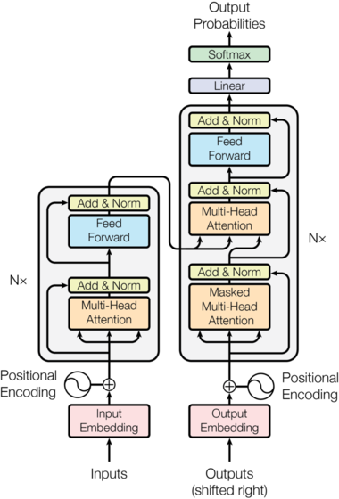

## Model Architecture

> 文档根据原文进行了补充重新排版

大多数竞争性（competitive，这里指的应该是**有竞争力**的意思）的神经序列转导模型都采用了**编码器-解码器**架构

```py
"EncoderDecoder.py"

class EncoderDecoder(nn.Module):
    """一个标准的Encoder-Decoder结构，作为其他模块的基础（上层调用）"""

    def __init__(self, encoder, decoder, src_embed, tgt_embed, generator):
        super(EncoderDecoder, self).__init__()
        self.encoder = encoder
        self.decoder = decoder
        self.src_embed = src_embed
        self.tgt_embed = tgt_embed
        self.generator = generator

    def forward(self, src, tgt, src_mask, tgt_mask):
        """应用encoder层后应用decoder层"""
        """Take in and process masked src and target sequences."""
        return self.decode(self.encode(src, src_mask), src_mask, tgt, tgt_mask)

    def encode(self, src, src_mask):
        return self.encoder(self.src_embed(src), src_mask)

    def decode(self, memory, src_mask, tgt, tgt_mask):
        return self.decoder(self.tgt_embed(tgt), memory, src_mask, tgt_mask)

```

```py
"Layer.py"

class Generator(nn.Module):
    """定义线性变换+应用softmax函数步骤"""

    def __init__(self, d_model, vocab):
        """定义一个线性变换函数"""
        super(Generator, self).__init__()
        self.proj = nn.Linear(d_model, vocab)

    def forward(self, x):
        """__call__调用，对x应用线性变换后再应用softmax函数"""
        return log_softmax(self.proj(x), dim=-1)
```

编码器将一组符号表示的输入序列$(x_1,\dots,x_n)$映射为一组连续表示的序列$z=(z_1,\dots,z_n)$。给定 z，解码器将会一次一个地（one element at a time）生成符号表示的输出序列$(y_1,\dots,y_m)$。这个模型中每一步都是自回归的，在生成下一个符号时会使用上一步生成的符号作为额外的输入

Transformer 模型整体架构遵循了**基于多重堆叠的自注意力、逐点（Point-Wise）、完全连接的编码器/解码器层**的设计



## Encoder and Decoder Stacks

Encoder 和 Decoder 各由一组 $N=6$ 个完全相同的 Layer 组成

```py
"Layer.py"

def clones(module, N):
    """将torch module深拷贝N次组成一个list返回"""
    return nn.ModuleList([copy.deepcopy(module) for _ in range(N)])
```

我们在每个子层中均创建了**残差连接**，并进行了**层归一化**

```py
"Layer.py"

class LayerNorm(nn.Module):
    """构建一个层归一化模块"""

    def __init__(self, features, eps=1e-6):
        super(LayerNorm, self).__init__()
        self.a_2 = nn.Parameter(torch.ones(features))
        self.b_2 = nn.Parameter(torch.zeros(features))
        self.eps = eps

    def forward(self, x):
        mean = x.mean(-1, keepdim=True)
        std = x.std(-1, keepdim=True)
        return self.a_2 * (x - mean) / (std + self.eps) + self.b_2
```

也就是说，每个子层的输出为 $LayerNorm(x + Sublayer(x))$
- Sublayer(x)是每个子层实现的函数，在 Figure 1 中对应 **Add & Norm** 前面的部分（如多头注意力和前馈网络）

此外，在子层函数的输出被加到下一个子层的输入并被归一化之前，我们在每个子层的输出端应用了一遍 `dropout` 函数

> dropout：
> tf.nn.dropout是TensorFlow里面为了防止或减轻过拟合而使用的函数，它一般用在全连接层。
> Dropout就是在不同的训练过程中随机扔掉一部分神经元。 也就是让某个神经元的激活值以一定的概率p，
> 让其停止工作，这次训练过程中不更新权值，也不参加神经网络的计算。

为了实现残差连接，模型中的每个子层（包括嵌入层）都会产生维度 $d_{model}=512$ 的输出

```py
"Layer.py"

class SublayerConnection(nn.Module):
    """
    子层间连接（每个Encoder/Decoder层包含多个子层）
    残差连接和层归一化部分
    为了代码的简洁性，这里先对x进行了归一化

    原文的公式为layerNorm(x+sublayer(x))
    这里的公式是x+sublayer(layerNorm(x))
    """

    def __init__(self, size, dropout):
        """
        定义dropout函数和层归一化函数
        """
        super(SublayerConnection, self).__init__()
        self.norm = LayerNorm(size)
        self.dropout = nn.Dropout(dropout)

    def forward(self, x, sublayer):
        """
        __call__调用
        对每个相同尺寸的子层输出应用残差链接
        """
        return x + self.dropout(sublayer(self.norm(x)))
```

### Encoder

Encoder的每一层都包含两个子层，第一个是**多头注意力机制**，第二个是简单的逐点全连接前馈网络

```py
"Encoder.py"

class Encoder(nn.Module):
    """由N层EncoderLayer构成"""

    def __init__(self, layer, N):
        super(Encoder, self).__init__()
        self.layers = clones(layer, N)
        self.norm = LayerNorm(layer.size)

    def forward(self, x, mask):
        """将x逐层编码后，经过层归一化丢给Decoder"""
        """Pass the input (and mask) through each layer in turn."""
        for layer in self.layers:
            x = layer(x, mask)
        return self.norm(x)

class EncoderLayer(nn.Module):
    """Encoder由self_attn和feed_forward构成"""

    def __init__(self, size, self_attn, feed_forward, dropout):
        """
        EncoderLayer由两个子层构成，通过SublayerConnection连接
        sublayer的具体行为在下文通过forward调用时定义

        :param size:
        :param self_attn: 自注意力层函数
        :param feed_forward: 前馈层函数
        :param dropout: Dropout函数
        """
        super(EncoderLayer, self).__init__()
        self.self_attn = self_attn
        self.feed_forward = feed_forward
        self.sublayer = clones(SublayerConnection(size, dropout), 2)
        self.size = size

    def forward(self, x, mask):
        """
        调用一个Encoder层的全部行为

        :param x: 输入
        :param mask:
        :return: Encoder层输出
        """
        x = self.sublayer[0](x, lambda x: self.self_attn(x, x, x, mask))
        return self.sublayer[1](x, self.feed_forward)
```

### Decoder

每个层除了编码器的两个子层外，解码器还加入了第三个子层，用于对编码器的输出执行多头注意力（performs multi-head attention over the output of the encoder stack）。和编码器类似，我们在每个子层中均创建了**残差连接**，并进行了**层归一化**

```py
"Decoder.py"

class Decoder(nn.Module):
    """由带有masking的N层DecoderLayer构成"""

    def __init__(self, layer, N):
        super(Decoder, self).__init__()
        self.layers = clones(layer, N)
        self.norm = LayerNorm(layer.size)

    def forward(self, x, memory, src_mask, tgt_mask):
        for layer in self.layers:
            x = layer(x, memory, src_mask, tgt_mask)
        return self.norm(x)

class DecoderLayer(nn.Module):
    """Decoder由self_attn、src_attn和feed_forward组成"""

    def __init__(self, size, self_attn, src_attn, feed_forward, dropout):
        """
        DecoderLayer由三个子层构成，通过SublayerConnection连接
        sublayer的具体行为在下文通过forward调用时定义

        :param size:
        :param self_attn: 自注意力层函数
        :param src_attn:
        :param feed_forward: 前馈层函数
        :param dropout: Dropout函数
        """
        super(DecoderLayer, self).__init__()
        self.size = size
        self.self_attn = self_attn
        self.src_attn = src_attn
        self.feed_forward = feed_forward
        self.sublayer = clones(SublayerConnection(size, dropout), 3)

    def forward(self, x, memory, src_mask, tgt_mask):
        """
        调用一个Decoder层的全部行为

        :param x: 输入
        :param memory
        :param src_mask
        :param tgt_mask
        :return: Encoder层输出
        """
        m = memory
        x = self.sublayer[0](x, lambda x: self.self_attn(x, x, x, tgt_mask))
        x = self.sublayer[1](x, lambda x: self.src_attn(x, m, m, src_mask))
        return self.sublayer[2](x, self.feed_forward)
```

### Mask

此外，我们修改了解码器中的自注意力子层，防止当前位置对后续位置的注意。通过这个Masking，结合**输出嵌入层（Output Embeddings）偏移了一个位置**（the output embeddings are offset by one position），保证了位置$i$的预测只能依赖于位置小于$i$的已知输出


```py
"Mask.py"

def subsequent_mask(size):
    """遮蔽后续位置"""
    attn_shape = (1, size, size)
    subsequent_mask = torch.triu(torch.ones(attn_shape), diagonal=1).type(
        torch.uint8
    )
    return subsequent_mask == 0
```

注：通过print该函数可以发现，该函数本质上是输出了一个指定大小的下三角矩阵


```py
print(subsequent_mask(5))

Output:
tensor([[[ True, False, False, False, False],
         [ True,  True, False, False, False],
         [ True,  True,  True, False, False],
         [ True,  True,  True,  True, False],
         [ True,  True,  True,  True,  True]]])
```

> 下方的 attention mask展示了每个 tgt 单词（行）被允许查看的位置（列）。在训练过程中，单词无法查看未来的单词。

```py
"Mask.py"

def example_mask():
    LS_data = pd.concat(
        [
            pd.DataFrame(
                {
                    "Subsequent Mask": subsequent_mask(20)[0][x, y].flatten(),
                    "Window": y,
                    "Masking": x,
                }
            )
            for y in range(20)
            for x in range(20)
        ]
    )

    return (
        alt.Chart(LS_data)
        .mark_rect()
        .properties(height=250, width=250)
        .encode(
            alt.X("Window:O"),
            alt.Y("Masking:O"),
            alt.Color("Subsequent Mask:Q", scale=alt.Scale(scheme="viridis")),
        )
        # .interactive()
    )

if __name__=="__main__":
    example_mask().show()
```


### Attention

注意力函数可以被描述为将一个查询和一组键值对映射到一个输出上（mapping a query and a set of key-value pairs to an output）
- 其中，查询、键和值均为向量

函数的输出是值向量的加权和，每个值向量的权重通过查询和相应的键的兼容性函数计算得出

我们将这个特殊的注意力机制称为**缩放点积注意力**（Figure 2），输入包含查询、维度为$d_k$的键和维度为$d_v$的值。我们**计算查询和所有键的点积（对应图中的MatMul），并除以$\sqrt{d_k}$（对应图中的Scale）**，将结果应用到一个 **softmax** 函数来得出值的权重


在实践中，我们同时计算一组查询的注意力函数——将查询封装在矩阵 $Q$ 中，同样地，键和值封装在矩阵 $K$ 和 $V$ 中，那么有输出矩阵的公式：

$$Attention(Q,K,V) = softmax(\frac{QK^T}{\sqrt{d_k}})V$$

```py
"Attention.py"

def attention(query, key, value, mask=None, dropout=None):
    """计算点积缩放注意力"""
    d_k = query.size(-1)
    "计算查询向量和键向量的点积，并除以sqrt(d_k)"
    scores = torch.matmul(query, key.transpose(-2, -1)) / math.sqrt(d_k)
    if mask is not None:
        scores = scores.masked_fill(mask == 0, -1e9)
    "调用softmax函数，将注意力得分转换为概率权重"
    p_attn = scores.softmax(dim=-1)
    if dropout is not None:
        p_attn = dropout(p_attn)
    "返回权重和值向量的点积结果"
    return torch.matmul(p_attn, value), p_attn
```

$$Attention(Q,K,V) = softmax(\frac{QK^T}{\sqrt{d_k}})V$$

两种常用的注意力函数是**加法注意力**和**点积（乘法）注意力**
- 点积注意力与我们的算法唯一的区别就是**缩放因子 $\frac{1}{\sqrt{d_k}}$** 
- 加法注意力通过一个具有隐藏层的前馈网络来计算兼容性函数
- 尽管两种算法的复杂度理论上的相近的，但是由于矩阵乘法有高度优化过的代码实现，因此点积注意力在实践中要更快、更节省时间

尽管在$d_k$较小时，两种注意力算法的表现相近；在对较大的$d_k$进行缩放时，加法注意力的表现要优于点积注意力。我们怀疑当 $d_k$ 较大时，点积会变得更大，从而将softmax函数推入一个梯度极小的区域。为了抵消这个影响，我们将点积缩放至 $\frac{1}{\sqrt{d_k}}$。
- 为了描述点积变大的原因，我们假设q和k的分量都是均值为0，方差为1的独立随机变量，那么它们的点积  $q·k = \sum_{i=1}^{d_k}q_ik_i$ 的均值为0，**方差为 $d_k$**
- 分量是向量中的各个数字，如果n个数字组成了一个n维向量，那么这n个数就被称作该向量的分量


多头注意力允许模型在不同的位置去关注不同的表示子空间的信息。With a single attention head, averaging inhibits this.

$$
Multihead(Q,K,V) = Concat(head_1,\dots ,head_h)W^O \\
where head_i = Attention(QW_i^Q,KW_i^K,VW_i^V)
$$

其中投影是参数矩阵：

$$
W_i^Q​\in \mathbb{R}^{d_{model​}\times d_k}​\\
W_i^K\in \mathbb{R}^{d_{model​}\times d_k}\\
W_i^V\in \mathbb{R}^{d_{model​}\times d_v}\\
W_i^O\in \mathbb{R}^{hd_v\times d_{model​}}
$$

在实践中我们采用 $h=8$ 个并行注意力层，或者说注意力头。对于每一个注意力头我们采用 $d_k = d_v =d_{model}/h = 64$.由于每个注意力头的维度较小，因此总共的计算成本与全维度（$d_{model}$)的单头注意力相近

```py
"Attention.py"

class MultiHeadedAttention(nn.Module):
    def __init__(self, h, d_model, dropout=0.1):
        """输入模型尺寸和注意力头数量"""
        super(MultiHeadedAttention, self).__init__()
        # 模型尺寸必然能够整除注意力头数量
        assert d_model % h == 0
        # 假定d_v永远等于d_k
        self.d_k = d_model // h
        self.h = h
        self.linears = clones(nn.Linear(d_model, d_model), 4)
        self.attn = None
        self.dropout = nn.Dropout(p=dropout)

    def forward(self, query, key, value, mask=None):
        """实现 Figure 2 中的算法"""
        if mask is not None:
            # 对所有 h 个注意力头应用相同的mask
            mask = mask.unsqueeze(1)
        nbatches = query.size(0)

        # 1) 从 d_model => h x d_k 批量进行所有线性投影，即将 d_model 分割为 h 个 d_k 分配给注意力头
        # Do all the linear projections in batch from d_model => h x d_k
        query, key, value = [
            lin(x).view(nbatches, -1, self.h, self.d_k).transpose(1, 2)
            for lin, x in zip(self.linears, (query, key, value))
        ]

        # 2) 对所有投影向量批量应用注意力
        # Apply attention on all the projected vectors in batch.
        x, self.attn = attention(
            query, key, value, mask=mask, dropout=self.dropout
        )

        # 3) 通过一个视图拼接并应用最终的线性变换，即将被分割为 h 个 d_k 维的注意力头重新拼接为一个 d_model 的向量
        # "Concat" using a view and apply a final linear.
        x = (
            x.transpose(1, 2)
            .contiguous()
            .view(nbatches, -1, self.h * self.d_k)
        )
        del query
        del key
        del value
        return self.linears[-1](x)
```

### Attention在模型中的应用

Transformer通过三种不同的方式应用多头注意力机制

1. 在*Encoder-Decoder*注意力层中，查询向量来自前一个解码器层，而键值向量来自编码器的输出。这允许解码器中的每个位置去关注整个输入序列中的所有位置。这个机制模仿了序列到序列模型中典型的*Encoder-Decoder*注意力机制
2. 编码器包含*自注意力层*，在这一层中，所有的键值和查询向量都来自于同一处，这里即前一层编码器层的输出。因此编码器层中的每个位置都可以去关注编码器前一层中的所有位置
3. 类似的，解码器中的自注意力层允许解码器中的每个位置都可以去关注解码器中**直到该位置为止的所有位置**。我们需要防止解码器中的*leftward information flow*来保留自回归属性。我们在缩放点积注意力中已经通过将softmax的输入中的非法值进行掩码（即设置为负无穷）来实现了这一点

## Position-wise Feed-Forward Networks

除了注意力子层之外，我们的编码器/解码器中的每一层都还包含一个全连接前馈网络，该网络分别且相同地应用于每个位置。它由两个线性变换组成，中间由一个ReLU激活。

$$
FFN(x)=max(0,W_1x+b_1)W_2+b_2
$$

其中$max(0,x)$部分即ReLU函数

虽然线性变换在整个序列中的不同位置都是相同的，但是在层与层之间使用的是不同的参数。另一种描述方式是描述为两个内核大小为1的卷积。

输入和输出的维度都是$d_model=512$，而内层的维度则是$d_{ff}=2048$

```py
"FeedForward.py"

class PositionwiseFeedForward(nn.Module):
    """实现FFN的方程"""

    def __init__(self, d_model, d_ff, dropout=0.1):
        """定义两个线性变换和dropout函数"""
        super(PositionwiseFeedForward, self).__init__()
        "从d_model变维到d_ff"
        self.w_1 = nn.Linear(d_model, d_ff)
        "从d_ff变维到d_model"
        self.w_2 = nn.Linear(d_ff, d_model)
        self.dropout = nn.Dropout(dropout)

    def forward(self, x):
        """在执行w_1函数后丢给ReLU，然后再执行w_2函数"""
        return self.w_2(self.dropout(self.w_1(x).relu()))
```

### Embeddings and Softmax

和其他序列传导模型类似，